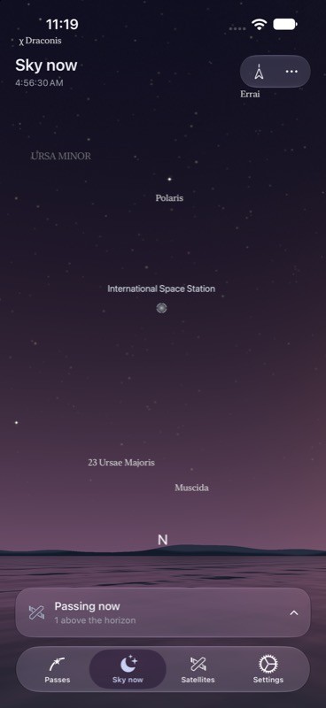

# Live Sky Now review

Reviewed on iPhone 17 Pro Max, iOS 27.0 simulator, in dark mode.

- Sky Now is always the second of four tabs. The experimental Settings control is removed.
- The shared 3D sky renders without a pass context or time-mode controls.
- Recorded ISS marker, stars, constellations, horizon/water, clock, and passing count were visually checked.
- This review uses a frozen recorded moment for reproducibility, not current orbital data: JD 2459373.9975694446, observer 37.486743°, −122.226560°, altitude 0 km. ISS azimuth 359.850534°, elevation 24.735276°. The TLE is the existing June 2021 `Fixture` in `ScreenSnapshotTests.swift`.
- Eleven targeted architecture/model/interpolation checks passed; two additional existing pass-track and preview-tracking checks passed. The opt-in full-tab visual review also passed. Routine Debug/XCTest telemetry remains suppressed.
- Live interpolation is compared against independent SGP4 samples; expired positions and selections disappear. Tests also cover loading only LEO candidates, stale location responses, permanent tab order, and a planetarium without a selected pass.
- Simulator build/run succeeded after each app-code revision. Physical-device performance and compass behavior were not measured.

For a repeatable review, create `/tmp/satellite-live-sky-review` and run
`PlanetariumTests/testLiveSkyNowDarkReview`. After its `-ready` marker appears,
capture the simulator; remove the review marker to finish. The host explicitly
sets the active scene phase so its Metal view renders during XCTest.

## In-memory catalog follow-up

Seven targeted checks passed on the dark-mode iPhone 17 Pro Max simulator after
the cache optimization. Twenty tab/location transitions invoke the catalog loader
once. Other checks cover refresh coalescing without hiding loaded elements,
cacheable empty results, cancelled-load isolation, original disk expiry, LEO
filtering, stale location responses, and invalid-download fallback. The app was
rebuilt and rerun; this change does not alter the reviewed layout above.

## Brightest 100 and forecast reentry follow-up

All 55 `ForecastTests` passed on the dark-mode iPhone 17 Pro Max simulator. New
checks verify the `visual` endpoint, a strict 100-candidate limit with standard
magnitude ordering, metadata cancellation after the current record, 20 Passes
tab returns without recalculation, forecast expiry/input changes/manual refresh,
and recovery of an interrupted forecast. Existing cache, orbital prediction,
location, and widget checks also pass. Sky Now has a separate orbital worker;
Passes retains completed forecasts for the existing one-hour window. Simulator
build/run succeeded. These are functional checks, not measured iPhone latency.
