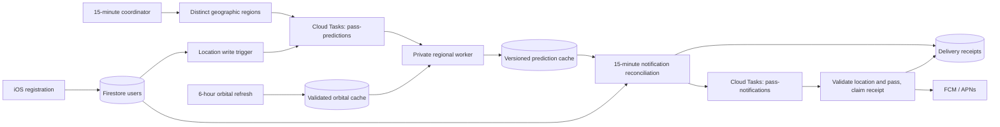

# Prediction and notification backend

## Runtime flow



The app registration contract stays `users/{FCM token}` with location, timezone
and locale fields. App code and custom product analytics are unchanged.

## Bounded prediction work

`refresh_all_user_transits` enumerates users in document-name order, backfills
missing geohashes, groups geographic regions, and enqueues work every 15 minutes.
It never calculates orbits. App writes use the same queue, deduplicated by region
and 15-minute interval. The periodic coordinator repairs missed write triggers.
Disabled/unregistered devices are excluded.

`process_prediction_region` is private. Cloud Tasks authenticates using the
project runtime service account. Queue concurrency and worker instances are
capped at 20; individual failures retry independently (10 attempts, up to one
hour). Task payloads contain only a five-character geohash, not a device token.
Each satellite has a transactional five-minute computation lease.

A five-character region uses its geohash center at sea level as a stable shared
observer. This avoids the old cache changing according to whichever device
wrote last. The app's precise, local calculations remain independent.

`prediction_cache/{satellite}_{region}` contains:

- `schema_version: 2`, `source_hash`, and `source_updated_at`.
- `generated_at` and `scan_end_time`.
- A temporary `lease_owner` and `lease_until`.
- `records/{pass_id}` with original transit geometry, a typed UTC
  `culmination_at`, and `expires_at`.

Changed TLE content, less than two days' remaining coverage, or a calculation
older than 12 hours causes a fresh seven-day scan starting **now**. Cache objects
older than seven days are rejected. The whole record set and coverage metadata
publish in one atomic batch with a parent update-time precondition. Failed
calculations cannot advertise complete coverage, and a stale worker cannot
publish after another worker acquires its lease.

The orbital solver can emit an incomplete grazing pass without a culmination
time. The cache writer skips that unschedulable record, reports a numeric count,
and preserves the other valid predictions rather than failing the whole region.

Pass identifiers survive time corrections within ten minutes; station orbits
are about ninety minutes apart. This keeps notification identity stable when
new TLEs shift a predicted pass. The new collection isolates writes from an old
monolithic refresh that might still be running during rollout.

## Notification reconciliation and delivery

The Cloud Run job `schedule-notifications` runs every 15 minutes, reconciling the
next 24 hours. It includes users with missing geohashes by deriving them from
coordinates rather than ordering a query by an optional field. Predictions are
cached per region for each run. Invalid registrations are skipped; operational
failures are counted and cause the job to fail rather than report false success.

Regular alerts retain the 20-degree threshold and five-minute lead time.
Prominent alerts require 60 degrees and three minutes' visibility and are sent
at 4 p.m. local time only if that is before the pass. Already-past notification
times are not replayed on recovery.

Existing notification collections remain compatible:
`scheduled_notifications/{token}/tasks/{satellite}_{pass_id}` and
`scheduled_prominent_notifications/{token}/tasks/{satellite}_{pass_id}`.

A transaction records the planned delivery before creating its deterministic
Cloud Task. The task name hashes device, kind, pass identity and due time; no raw
token is in the task name. Reconciliation repeats task creation safely when a
previous run failed between the Firestore write and Cloud Tasks creation.
Changed due times create a new task revision; old revisions are acknowledged
without sending. Existing legacy tasks are honored during migration.

Delivery claims a two-minute transactional lease, then rechecks the current
location, current versioned pass and visibility threshold. Expired, removed,
relocated, or substantially delayed passes are acknowledged as skipped.
Unregistered tokens are disabled without deleting user data. Successful FCM
acceptance leaves a `sent` receipt; transient errors leave it retryable.
APNs collapse IDs provide an additional duplicate-reduction mechanism.

**Delivery is at least once, not exactly once.** A crash after FCM accepts but
before Firestore records success can cause a retry; neither Firestore nor FCM
provides a transaction spanning both systems. A `sent` receipt proves FCM
acceptance, not that the phone displayed or the user saw the alert.

Firestore TTL cleans receipt documents seven days after their pass/completion
and prediction records two days after the pass. Historical documents without an
`expires_at` field are unaffected. The old weekly transit cleanup remains for
the legacy collection.

## Operations and verification

`backend_health/prediction_dispatch` records completion time, total user count,
unique regions and queued tasks. `backend_health/notification_scheduler` records
completion time, users, reconciled tasks, invalid registrations and errors.
Workers emit structured `prediction_region_completed` / `prediction_region_failed`
logs; delivery emits acceptance, skip reason and sanitized failure categories.
Device identifiers, locations and raw exception text are omitted from these new
operational logs. These records are not custom Firebase Analytics events.

Investigate a coordinator/scheduler completion older than 30 minutes, nonzero
scheduler errors, growing oldest-task age, repeated worker failures, or orbital
cache age over 12 hours. Health records and logs are available now; external
paging/notification routing is not configured by this change.

Run regression tests:

```sh
functions/venv/bin/python -m unittest discover -s tests -p 'test_*.py' -v
orbital_functions/venv/bin/python -m unittest discover -s orbital_functions -p 'test_*.py' -v
```

The rollout also validates real Firestore concurrent delivery claims without
sending FCM messages. Unit tests cover timestamp parsing, leases, source-version
invalidation, atomic publication, stable identity, creation retries, legacy
compatibility, eligibility thresholds, location changes and delivery receipts.

## Deployment and rollback

Use `scripts/deploy_backend.sh` from this directory to reconcile the runtime
configuration. For an initial migration, create and pause the prediction queue
until the worker has deployed and its invoker grant is installed. Resume it only
after a targeted regional validation. Keep the notification scheduler on its old
cadence until the new handlers and job are ready, then change it to 15 minutes.
Never purge either queue as part of deployment.
Firebase may reset a private function's service-level invoker policy during an
update; the deployment script reapplies the runtime service-account grant after
every deploy. Do the same after a targeted manual worker deployment.

Existing legacy predictions and delivery endpoints remain available. To roll
back the new workers, pause `pass-predictions` and restore the previous function
source and Cloud Run job image, then restore the previous scheduler cadence.
The notification job can temporarily read legacy `transits` when no completed
v2 cache exists. Once a v2 cache exists, stale v2 coverage is reported as an error
rather than silently falling back. Keep receipt documents during rollback to
preserve delivery history; deleting them weakens duplicate suppression.
